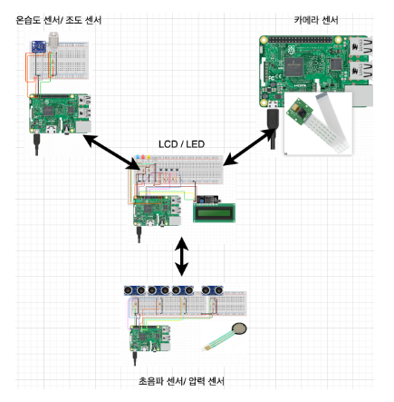

# StudyBuddy

## 2023 Spring System Programming and Practice Team Project: StudyBuddy
* 시스템 프로그래밍 및 실습: Raspberry Pi 환경에서 Sensor – Actuator를 이용하는 프로그램 개발
* 프로젝트 기간: 2023.05.01 ~ 2023.06.12
* 프로젝트 이름: StudyBuddy
* 프로젝트 목표: 사용자의 학습 환경을 지속적으로 피드백하는 프로그램 제작 

## StudyBuddy
  1. 사용자가 의자에 앉으면, 타이머로 원하는 시간을 설정한다.
  2. 타이머를 시작하면 지속적으로 사용자의 착석 자세를 트래킹하고, 주변환경을 피드백한다.
  3. 문제가 있는 경우 LED로 즉각적인 피드백을 표시하여 교정 혹은 개선할 수 있도록 도움을 준다.
  4. 타이머가 끝나면 소켓을 닫고 통신을 종료한다.
 
* server: LCD/LED Pi
* client: 카메라, 초음파/압력, 온습도/조도 pi

## 회의 내용

### 5/19 회의
* 시프 proposal 발표 정리
* 피드백 내역
  1. 다양한 센서 사용 (프로젝트 규모—4인이 할 규모- goal을 더 넓히는….)
  2. 구현 가능성
  3. 4대가 유기적으로 사용되게 구현 바람
  4. 프로젝트 목표가 좀 더 명확하기를 바란다. 
  5. 적외선 센서/카메라 센서
  6. 초음파 센서 상시 전원은 optimizing 필요
  7. 기능이 얼마나 다양해야하는 것인가요………

* 토론 내역
  1. DC모터를 이용한 바람개비
  2. LED 사용 구상
    * 온도, 습도 각각 하나
    * 조도 하나
    * 초음파 하나
    * 카메라 하나
    
### 5/26 회의
* 파트 정리
  * 준서: 카메라 테스트해보고 가능하면 사용
  * 다인: 초음파(5개)+압력센서(1개) — 압력센서/ 초음파 센서 양 옆 (2)+ y축(3) 
  * 종호: LCD 출력 + LED — 버튼 이용한 타이머 설정(LED 점등) + 타이머 보여주기/  통신 입력
  * 지영: 온습도+ 조도 + 바람개비(온도) -온습도 센서 파악 + 바람개비 설정 / 조도 센서 파악
   
* 통신 정리
  * start: 압력센서 → 카메라, LCD, 온습도/조도에 signal
  * 이후 카메라, 초음파, 온습도/조도 → LED로 signal
  * LCD 측에서 버튼을 누르면 데이터 전송을 중단

### 6/2 회의
* 통신 세부 정리
  * 처음에 앉았을 때 압력센서에 신호 → lcd에 신호
  * 종호님이 준서님이랑 지영님, 다인님 다시 신호

-> 카메라 따로
-> 불쾌 지수 센서(2)/ 조도 센서 신호(1) 둘 (3)
-> 다인님 초음파센서 자세 신호

-> lcd파트에서 LED
-> 타이머 종료되면 다른 파이에 신호
-> 중간에 종료되어도 다른파이에 신호

### 6/7 회의
* server - client 소켓 정리
* server에서 thread를 3개 열어서 초음파, 카메라, 온습도/조도와 소켓 통신
* C - Python간 통신 방법 정리
* 카메라 - opencv + openpose (MobileNet기반) 시도

### 6/9 회의
* 구현 영상 촬영
* docs, ppt 구성 토론
